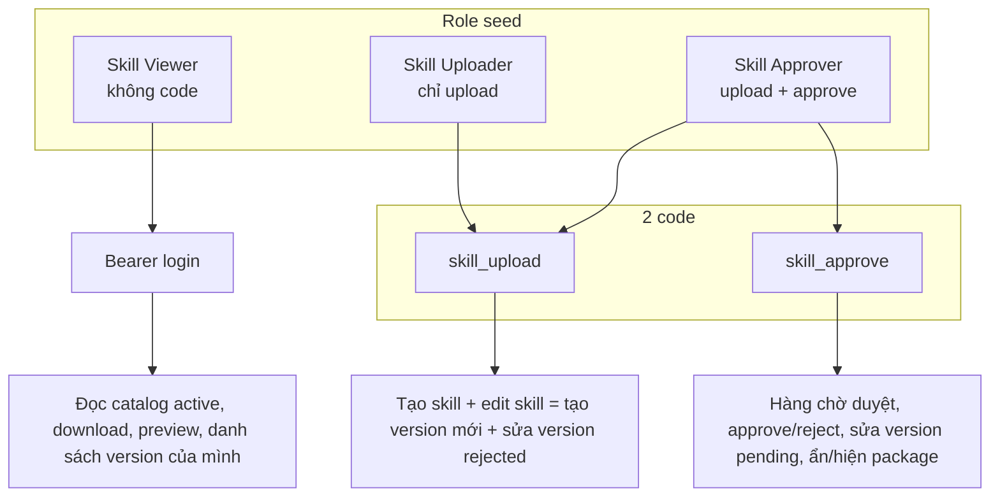
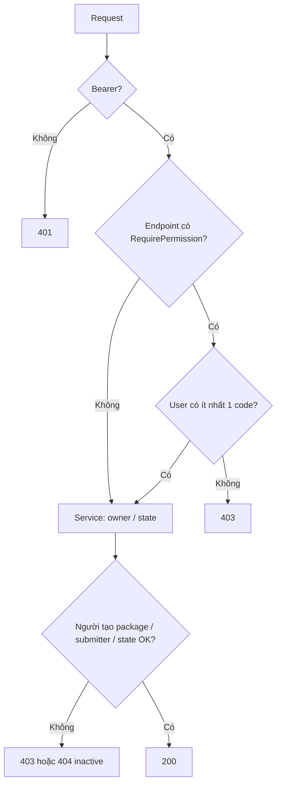

# Phân quyền Skill (hiện tại)

Skill chỉ có **2 code**: `skill_upload`, `skill_approve`. Không có `skill_view` / `skill_edit` / `skill_delete`.

**Edit skill = tạo version mới** (`PUT /items/:id/versions`), không phải PATCH package.

`PermissionGuard` nhiều code = **OR** (có một code là qua).

## Phân bổ code theo role (seed)

| Role (seed test) | Code | Được làm |
|---|---|---|
| Skill Viewer | không | Đọc skill **active** |
| Skill Uploader | `skill_upload` | Tạo skill; **edit skill** (tạo version mới) trên package mình tạo; sửa version **rejected** newest (mình submit hoặc mình tạo package) |
| Skill Approver | `skill_upload` **và** `skill_approve` | Mọi việc của uploader trên **mọi** package + duyệt, sửa **pending** (bỏ qua zip), ẩn/hiện package, xem inactive |

Production gán code qua role → permission. Seed chỉ là mẫu.

## Phân bổ theo API

Hai lớp: **guard** (code) rồi **service** (owner / state).

### Đọc — chỉ Bearer; không đòi code

| API | Ai được |
|---|---|
| `GET /items` | Active. `status=inactive` chỉ người có `skill_approve` |
| `GET /items/:id` | Active: mọi user login. Inactive: **người tạo package** hoặc `skill_approve`, không thì 404. Lịch sử version chỉ **approved**. `isUpdate` = có approve **hoặc** (upload và là người tạo package) — nút **edit skill = tạo version mới** |
| `GET /items/:id/download` | Cùng rule inactive như detail. Zip của version **active** |
| `GET /items/:id/files/preview` | Cùng download. Chỉ `skill.md` / `README.md` ở root zip |
| `GET /versions` | Mọi role: chỉ version mình submit **hoặc** package mình tạo. `isUpdate` = có upload **và** version **rejected** **và** newest |
| `GET /versions/:vid` | Người submit **hoặc** người tạo package **hoặc** `skill_approve` |
| `GET /versions/:vid/diff` | Guard: upload **OR** approve. Service: submitter / người tạo package / approve |
| `GET /reviews`, `/reviews/submitters` | Guard `skill_approve` |
| `GET /my-permissions` | `{ canUpload, canApprove }` |

### Ghi

| Việc | API | Guard | Service còn chặn |
|---|---|---|---|
| Tạo skill | `POST /items` | `skill_upload` | — |
| **Edit skill = tạo version mới** | `PUT /items/:id/versions` | `skill_upload` | Người tạo package **hoặc** có `skill_approve`. 409 nếu đang có pending |
| Sửa version đã có | `PUT /versions/:vid` | upload **OR** approve | **Rejected:** upload + (submitter hoặc người tạo package) + newest. **Pending:** approve, bỏ qua `file` |
| Approve / reject | `POST .../approve`, `.../reject` | `skill_approve` | Chỉ version **pending** |
| Ẩn/hiện package | `PATCH /items/:id/status` | `skill_approve` | `active` / `inactive` |

Không endpoint nào đòi cả hai code (AND). Approver seed cầm cả hai nên **edit skill (tạo version mới)** được trên mọi package.

## Quyền không tách riêng

| Việc | Có code riêng? | Thực tế |
|---|---|---|
| Xem | không `skill_view` | Mọi user login |
| Edit skill | không `skill_edit` | = tạo version mới, cần `skill_upload` |
| Sửa metadata package | không | Đi kèm tạo version mới hoặc sửa version |
| Xóa | không | Không API xóa |
| Download / preview | không | Cùng rule đọc detail |
| Sửa version pending | không | Nằm trong `skill_approve`, bỏ qua zip |

## Tầng quyết định

Hai việc “sửa” khác nhau:

1. **Edit skill** = `PUT /items/:id/versions` → **tạo version mới** (pending). Version active cũ vẫn chạy.
2. **Sửa version** = `PUT /versions/:vid` → sửa **đúng bản** rejected (uploader) hoặc pending (approver).
